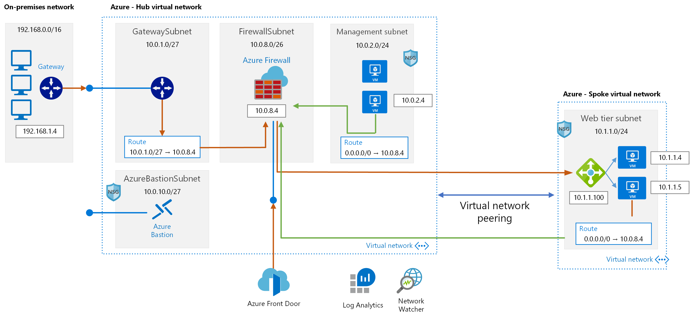

## Requirements

1. main.tf ファイルを編集し、以下の設定を変更します。(ローカル)
   * Provider AzureRM を検索し、サブスクリプション情報と一致するように変更します。
     * subscription_id = Your Azure Subscription ID
     * client_id       = Your Azure Service Principal App ID
     * client_secret   = Your Azure Service Principal Client Secret
     * tenant_id       = Your Azure Tenant ID
    * サービスのプリンシパルがない場合は、このガイドに従って作成してください。
    https://www.terraform.io/docs/providers/azurerm/guides/service_principal_client_secret.html
    
2. terraform.tfvars ファイルを編集し、以下の変数値を変更します。
   * location = デプロイしたいAzureリージョン
   * prefix = リソースの作成に使用されるプレフィックス文字列
   * adminname = Windows VM ローカル管理者名
   * adminpwd = Windows VM ローカル管理者パスワード (複雑で12文字の長さでなければなりません)
   * vmsize = "Standard_D2s_v3" (使用したいAzure VMのサイズ、必要に応じて変更)
   * frontdoorname = Azure Front Door ホスト名。これは後にFront Doorにアクセスする際に使用する名前で、一意でなければなりません。 
     例: myfrontdoor01.azurefd.net

   > Azure Cloud Shell を使用して terraform テンプレートを実行することができます: https://shell.azure.com 

3. terraform環境を初期化します。
   
   > terraform init
   
4. terraformの導入を計画し、レビューします。
   
   > terraform plan
   
5. terraformテンプレートを適用します。

   > terraform apply

## テストする

* ネットワークの基本ガイドのエクササイズ11に従ってください: https://github.com/adicout/lab/tree/master/Network/basic-networking
* 玄関先のホスト名（例：myfrontdoor.azurefd.net）を取得し、お好きなインターネットブラウザを使ってアクセスしてください。
  * ウェブサイトはHTTP（TCP 80）ポートにのみ応答するため、HTTPを使用する必要があります： http://myfrontdoor.azurefd.net
  * Spoke VNET上でWebアプリケーションにアクセスできるはずです。
  * アクセスはAzure Front DoorからAzure Firewallに流れていますが、Azure FirewallではNATルールがあり、プライベートIP経由でWebサイトを公開している内部のロードバランサーに通信を送信しています。

## すべてのリソースを清掃する

Azure NetworkingのTerraformラボを無事に終了したら、Resource Groupsを削除します。以下のterraformコマンドを実行します。

   > terraform destroy

